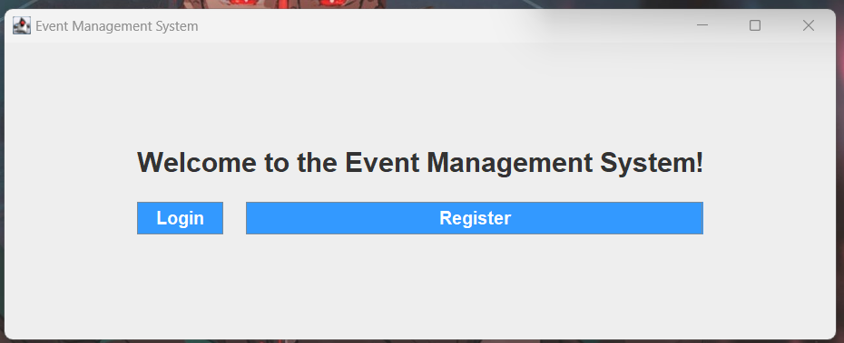
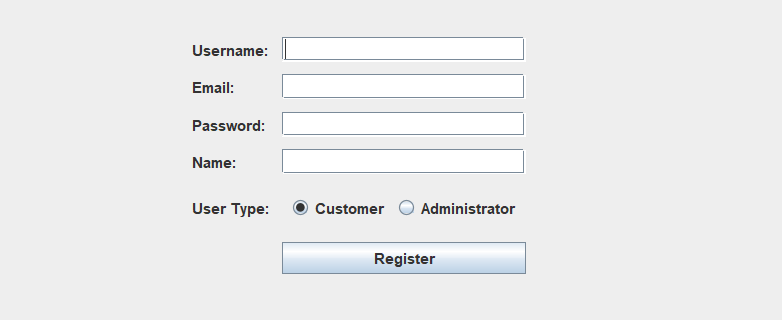
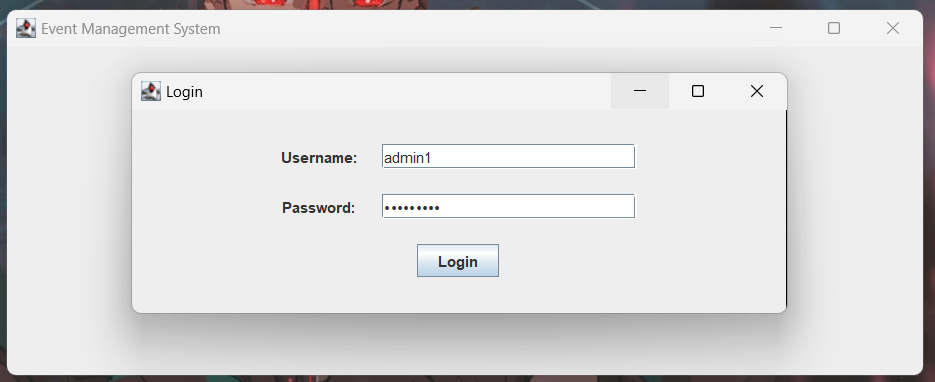

# Event Registration Portal

A GUI-based Java project that allows users to register and log in for events, with data being stored in a MySQL database. This project demonstrates user interface design, database connectivity using JDBC, and modular code using the DAO pattern.

---

## 🔧 Tech Stack

* **Language:** Java (JDK 21)
* **IDE:** IntelliJ IDEA / Eclipse
* **Database:** MySQL 8.0+
* **JDBC Driver:** mysql-connector-j-9.3.0.jar
* **GUI Framework:** Swing

---

## 📁 Project Structure

```
Event_Management_System/
├─ src/
│   ├─ com/eventmanagement/
│   │   ├─ WelcomePageUI.java
│   │   ├─ RegistrationFormUI.java
│   │   ├─ User.java
│   │   ├─ UserDAO.java
│   │   ├─ DatabaseConnection.java
│   └─ lib/
│       └─ mysql-connector-j-9.3.0.jar
```

---

## 🗃️ Database Schema

Database Name: `event_db`

### Table: `users`

| Column Name | Type                  | Description     |
| ----------- | --------------------- | --------------- |
| id          | INT (AUTO\_INCREMENT) | Primary Key     |
| name        | VARCHAR(100)          | Full Name       |
| email       | VARCHAR(100)          | Email (Unique)  |
| password    | VARCHAR(100)          | Hashed Password |

---

## 🔌 Database Connectivity (JDBC)

* JDBC is implemented via `DatabaseConnection.java`.
* Uses `Class.forName("com.mysql.cj.jdbc.Driver")` for compatibility.
* Connection string format:

  ```java
  String url = "jdbc:mysql://localhost:3306/event_db";
  Connection conn = DriverManager.getConnection(url, "root", "your_password");
  ```

---

## 🧩 DAO Pattern

* **UserDAO.java** handles all user-related DB operations:

  * `registerUser(User user)`
  * `validateLogin(String email, String password)`

---

## 🎨 UI/UX Design

* Designed using Java Swing.
* Form fields include name, email, and password.
* Welcome page and registration form fully aligned and centered.
* Consistent fonts and layout.

---

## 🏃 How to Run

1. Clone the repo:

```bash
git clone https://github.com/your-username/Event-Registration-Portal.git
```

2. Add `mysql-connector-j-9.3.0.jar` to your classpath.
3. Create the database and table using the provided SQL script.
4. Compile:

```bash
javac -cp .;lib/mysql-connector-j-9.3.0.jar com/eventmanagement/*.java
```

5. Run:

```bash
java -cp .;lib/mysql-connector-j-9.3.0.jar com.eventmanagement.WelcomePageUI
```

---

## 🧪 Features

* User Registration
* Email Uniqueness Check
* Login Validation
* Basic Error Handling

---

## 📸 Screenshots

**Welcome Screen:**


**Registration Form:**


**Login:**


---

## 📌 Notes

* Ensure MySQL server is running.
* Change DB credentials in `DatabaseConnection.java` if needed.
* Email field should be unique in the table.

---

## 📚 Contribution

This project is created for Review 1 of GUI-based project assessment. Contributions are welcome for UI improvement, validations, and error handling.
